<p align="center">

</p>

**LiterAlura** es una aplicación en Java para gestionar y consultar un catálogo de autores y libros. La aplicación permite realizar **búsquedas avanzadas, generar estadísticas y explorar** una base de datos con autores y libros. Su objetivo es brindar una experiencia enriquecedora en la administración y consulta de contenido literario.

La aplicación utiliza la API de [Gutendex](https://gutendex.com/ "API para libros de dominio público") 📜, para obtener datos de libros de dominio público, maneja respuestas en formato JSON, y permite persistir estos datos en una base de datos PostgreSQL, desde la que luego podemos realizar diversas consultas para mostrar todo lo relacionado con Libros y Autores.

Los resultados se filtran y muestran en la consola de manera interactiva.

## 📚Insignia Challenge LiterAlura

<p align="center">

</p>

## 📑Tabla de Contenidos
- [Características](#características)
- [Tecnologías Utilizadas](#tecnologías-utilizadas)
- [Instalación y Configuración](#instalación-y-configuración)
- [Guía de Uso](#guía-de-uso)
    - [Menú Principal](#menú-principal)
    - [Funcionalidades](#funcionalidades)
- [Consultas y Métodos Destacados](#consultas-y-métodos-destacados)
    - [Estadísticas](#estadísticas)
    - [Top 10 Libros Más Descargados](#top-10-libros-más-descargados)
    - [Filtros y Validaciones](#filtros-y-validaciones)
- [Autor](#autor-alberto-vallecillo)

## ✨Características

🔍**Búsqueda y Registro de Libros por Título**: Consulta a la API de [Gutendex](https://gutendex.com/ "API para libros de dominio público") 📜 para buscar libros por título. Al encontrar un libro, lo registra y almacena en la base de datos, evitando duplicados al verificar previamente su existencia. Si el libro ya está registrado, muestra su información junto con un mensaje indicando que ya estaba en el catálogo.📚**Búsqueda de Libros por Título y por Idioma**: Busca libros usando consultas directas en la base de datos. Filtra libros por idioma en la base de datos. Los idiomas deben ingresarse en formato ISO 639-1 (ej., es para español).✒️**Búsqueda de Autores por Nombre**: Encuentra autores rápidamente mediante consultas en la base de datos.📊**Estadísticas Avanzadas**: Genera estadísticas detalladas sobre libros y autores, incluyendo número de descargas y edad de los autores en diversos contextos.📝**Listados Personalizados**: Muestra autores vivos en un año determinado y permite filtrar autores por rango fecha de nacimiento.✅**Validación de Datos de Entrada**: Asegura que los datos ingresados sean correctos y previene errores con un flujo de control robusto.🚀**Optimización en la Consulta de Datos**: Uso de *Derived Queries* y métodos de resumen para optimizar el rendimiento y precisión en las estadísticas.

🛠️Tecnologías Utilizadas

- **Java 17**: Lenguaje de programación.
- **Spring Boot**: Framework para crear aplicaciones basadas en Spring.
- **PostgreSQL**: Base de datos relacional utilizada para almacenar información de libros y autores.
- **Hibernate**: Para la gestión de persistencia y mapeo de objetos relacionales (ORM).
- **DoubleSummaryStatistics**: Utilizado para obtener estadísticas detalladas de valores numéricos.

## 🛠️Instalación y Configuración

### ⚙️Requisitos Previos
- Java 17 o superior.
- PostgreSQL con una base de datos configurada para el proyecto (ver archivo `application.properties`).
- IntelliJ IDEA (recomendado) o cualquier IDE compatible con Java y Spring Boot.

### 🔧Configuración
1. Clona este repositorio.
2. Configura los detalles de la base de datos en `src/main/resources/application.properties`:
   ```properties
   spring.datasource.url=jdbc:postgresql://tu_localhost:tu_Port/tu_nombre_Base_Datos
   spring.datasource.username=tu_usuario
   spring.datasource.password=tu_contraseña
3. Crea una base de datos en PostgreSQL (en mi caso utilicé la versión 17) en mi caso la nombre literalura
4. Paso siguiente puedes probar con la Base de Datos del archivo `literalura.sql` de este repositorio, que ya tiene datos para utilizar y para ello, deberás hacer un Restaurar desde pgAdmin 4 por ejemplo, desde donde hayas descargado el archivo `literalura.sql`. Si no, ejecuta la aplicacion desde tu IDE y empieza a llenar tu propia base de datos.
5. Ejecuta la aplicación desde tu IDE o desde la línea de comandos:
   ```bash
   ./mvnw spring-boot:run

## 📖Guía de Uso

### 📝Menú Principal
Una vez iniciada la aplicación, se muestra un menú interactivo en la consola:
```markdown
**************************************************
*                 ~ LITERALURA ~                 *
**************************************************
*                 MENU PRINCIPAL                 *
**************************************************
1 - Buscar Libro por Título
2 - Listar Libros Registrados
3 - Listar Autores Registrados
4 - Listar Autores vivos en un determinado año
5 - Listar Libros por Idioma
6 - Buscar Autor por nombre
7 - Listar Autores por rango de años de Nacimiento
8 - Top 10 libros más descargados
9 - Estadísticas
0 - Salir

Opcion:
```

### 🚀Funcionalidades
1. **Buscar Libro por Título**: Realiza una búsqueda por coincidencia parcial del título en la API de Gutendex, luego la persiste en la base de datos.

<div style="display: flex; justify-content: center;">
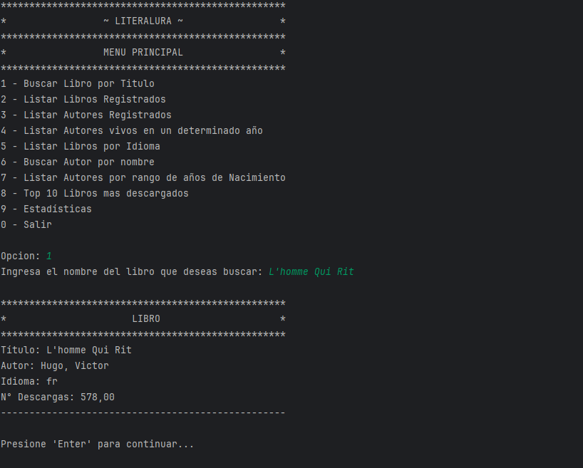
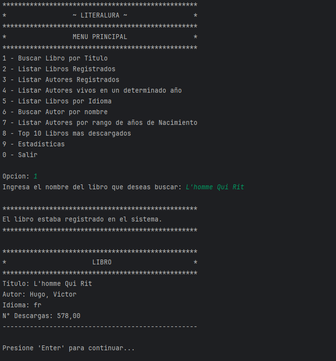
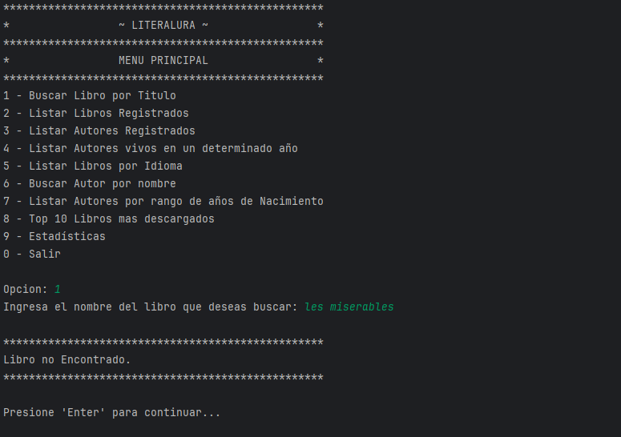
</div>

2. **Listar Libros Registrados**: Muestra una lista de todos los libros en el catálogo.

<p align="center">
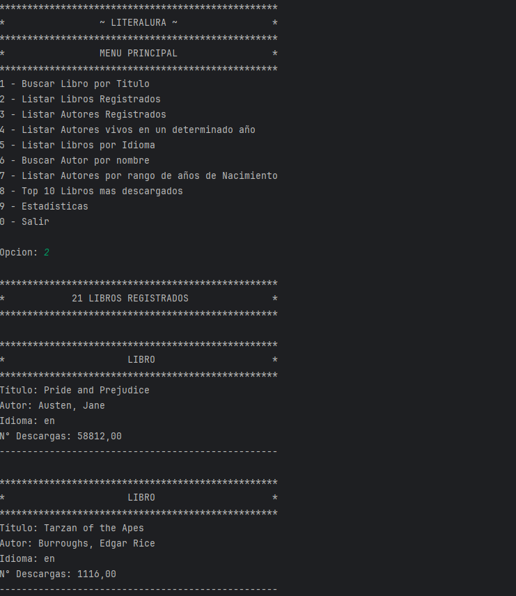
</p>

3. **Listar Autores Registrados**: Muestra una lista de autores junto con sus datos relevantes.

<p align="center">
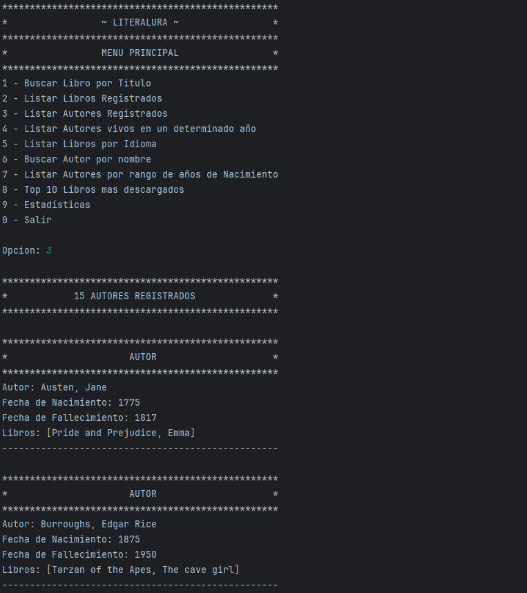
</p>

4. **Listar Autores vivos en un determinado año**: Permite al usuario ingresar un año y ver autores que aún vivían en esa fecha, basándose en la fecha de nacimiento y fallecimiento registrada.

<p align="center">
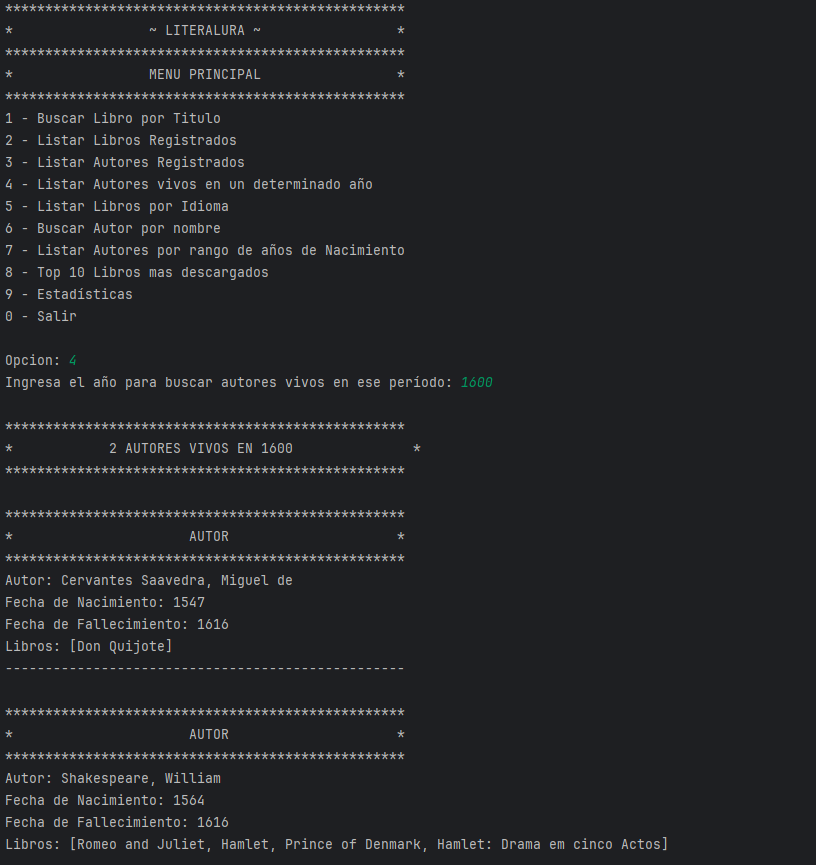
</p>

5. **Listar Libros por Idioma**: Muestra libros disponibles en un idioma específico. Los idiomas deben ingresarse en formato ISO 639-1 (ej., es para español).

<p align="center">
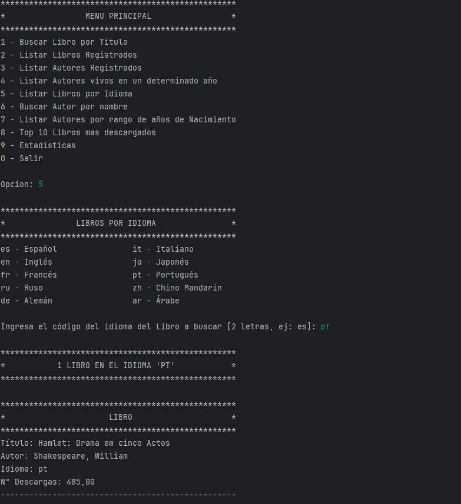
</p>

6. **Buscar Autor por Nombre**: Realiza una búsqueda por el nombre del autor (o que incluya su nombre parcial).

<p align="center">
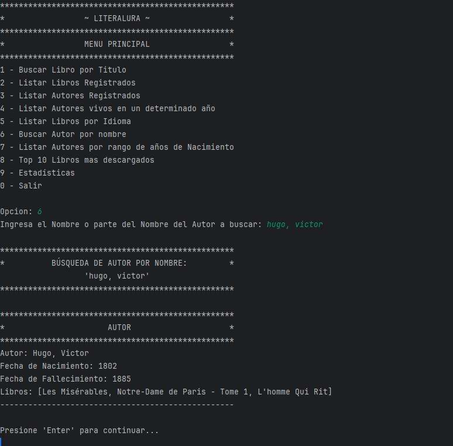
</p>

7. **Listar Autores por Fechas**: Filtra autores nacidos dentro de un rango de años específico.

<p align="center">
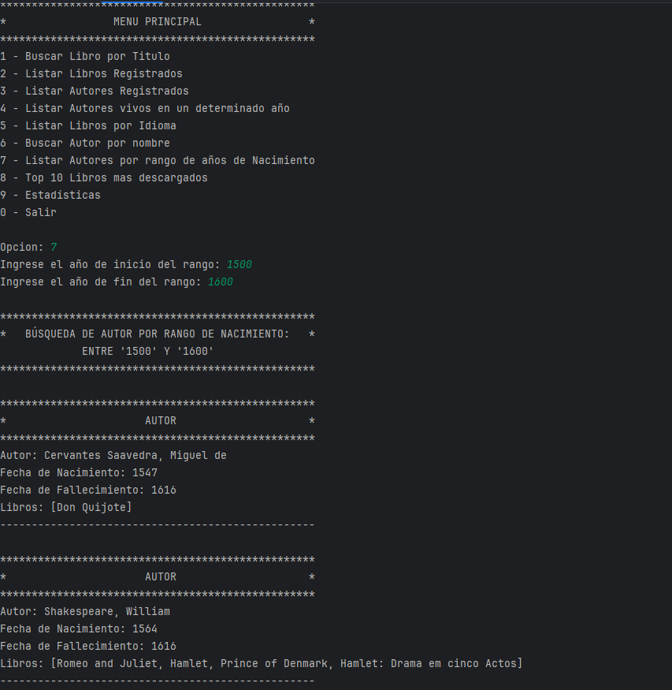
</p>

8. **Top 10 Libros Más Descargados**: Muestra los 10 libros más descargados, ordenados de mayor a menor.

<p align="center">
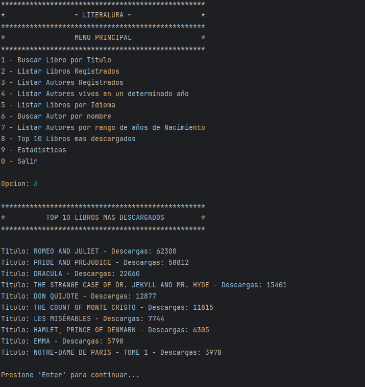
</p>

9. **Estadísticas**: Genera estadísticas de descargas y edades de los autores en función de sus fechas de nacimiento y fallecimiento.

<p align="center">
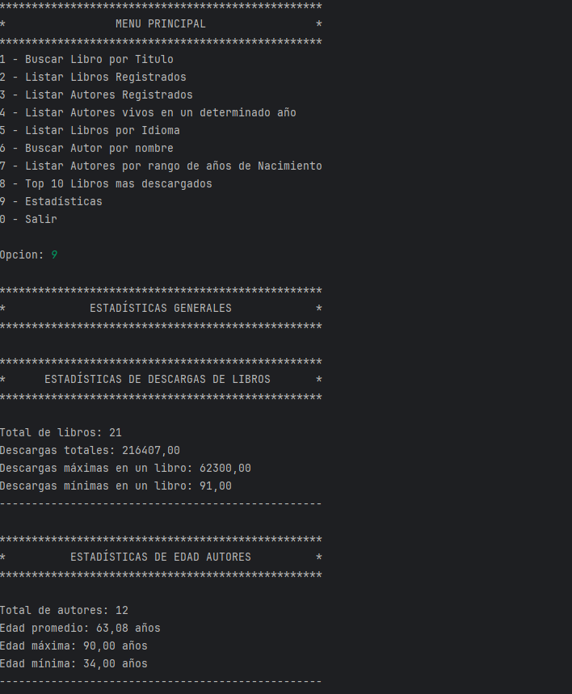
</p>

## 📊Consultas y Métodos Destacados
### 📈Estadísticas
Se utilizan métodos avanzados de Java, como `DoubleSummaryStatistics`, para analizar y resumir datos relevantes, como el número de descargas y la edad de los autores. Ejemplo de uso:

```java
private void mostrarEstadisticasDescargasLibros() {
    DoubleSummaryStatistics estadisticasDescargas = libroRepository.findAllWithAutores().stream()
            .mapToDouble(Libro::getNumeroDeDescargas)
            .summaryStatistics();

    System.out.println("""
            
            **************************************************
            *      ESTADÍSTICAS DE DESCARGAS DE LIBROS       *
            **************************************************
            """);
    System.out.printf("Total de libros: %d%n", estadisticasDescargas.getCount());
    System.out.printf("Descargas totales: %.2f%n", estadisticasDescargas.getSum());
    System.out.printf("Promedio de descargas por libro: %.2f%n", estadisticasDescargas.getAverage());
    System.out.printf("Descargas máximas en un libro: %.2f%n", estadisticasDescargas.getMax());
    System.out.printf("Descargas mínimas en un libro: %.2f%n", estadisticasDescargas.getMin());
    System.out.println("--------------------------------------------------");
}
```

### 📚Top 10 Libros Más Descargados
Consulta eficiente en la base de datos para obtener los libros más descargados:

```java
@EntityGraph(attributePaths = "autores")
List<Libro> findTop10ByOrderByNumeroDeDescargasDesc();
```

### ✅Filtros y Validaciones
1. **Validación de Año con 4 Dígitos**: Garantiza que los años ingresados sean válidos mediante el método `validarAnio4Digitos`.
```java
private boolean validarAnio4Digitos(String anio) {
return anio.matches("\\d{4}");
}
```
2. **Filtro de Rango de Nacimiento**: Método que asegura que el año de inicio sea menor o igual que el año de fin.

3. **Consulta de Autores en un Rango de Años**: Filtra los autores en función de sus años de nacimiento:
```java
@EntityGraph(attributePaths = "librosDelAutor")
List<Autor> findByFechaNacimientoBetween(String inicio, String fin );
```
¡Gracias por explorar LiterAlura! Espero que esta herramienta enriquezca tu experiencia literaria.

Usa el código con precaución. 🚀

### 👨‍💻Autor: Alberto Vallecillo
<div style="display: flex; justify-content: flex-start;">
<a href="https://linkedin.com/in/alberto-vallecillo" target="_blank">

</a>
<a href="https://github.com/Alb3rtoGitHub" target="_blank">

</a>
</div>
